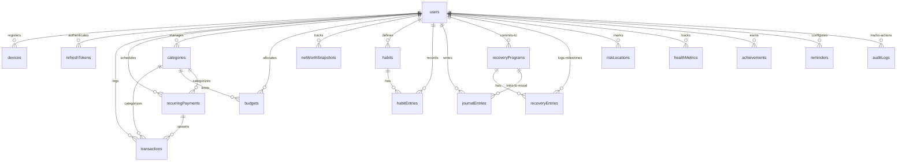

# Life OS — Enterprise Architectural Specification & API Design

This document details the refined architecture, unified entity-relationship mappings, database schema schemas, and API design for the **Life OS** platform, addressing all structural, normalization, security, and scalability gaps identified in the architectural review.

---

## 1. Unified Entity-Relationship Diagram (Mermaid)

The following Mermaid diagram maps the exact relationships across the 25 collections. Bidirectional sync-eligible nodes carry sync status metadata; server-only collections (e.g., `auditLogs`, `refreshTokens`) operate outside the sync boundaries.



---

## 2. Updated Data Dictionary (All 25 Collections)

### Core System Cluster

#### 1. `users`
*Represents the primary user profile and system preferences.*
* **`_id`**: `ObjectId` (Primary Key)
* **`email`**: `String` (Unique, Required)
* **`passwordHash`**: `String` (Required)
* **`fullName`**: `String` (Required)
* **`currency`**: `String` (Default: `INR`)
* **`timezone`**: `String` (Default: `UTC`)
* **`createdAt`**: `Date`
* **`updatedAt`**: `Date`

#### 2. `devices`
*Represents logged-in devices managing offline sync cursors.*
* **`_id`**: `ObjectId` (Primary Key)
* **`userId`**: `ObjectId` (Index, Shard Key)
* **`deviceId`**: `String` (Unique, Required)
* **`platform`**: `String` (Enum: `android`, `ios`, `web`, `windows`, `macos`, `linux`)
* **`lastSyncAt`**: `Date` (Used for cursor pull offsets)
* **`pushToken`**: `String` (Optional, for push notifications)
* **`createdAt`**: `Date`

#### 3. `refreshTokens`
*Server-internal authentication token storage. No client sync.*
* **`_id`**: `ObjectId` (Primary Key)
* **`userId`**: `ObjectId` (Index)
* **`token`**: `String` (Unique, Required)
* **`deviceId`**: `String` (Required)
* **`expiresAt`**: `Date` (TTL Index)
* **`createdAt`**: `Date`

#### 4. `auditLogs`
*Server-internal ledger tracking user actions for security compliance.*
* **`_id`**: `ObjectId` (Primary Key)
* **`userId`**: `ObjectId` (Index, Shard Key)
* **`action`**: `String` (e.g., `user.auth.login`, `transaction.delete`)
* **`ipAddress`**: `String`
* **`userAgent`**: `String`
* **`createdAt`**: `Date`
* **`expiresAt`**: `Date` (Set at write time to `createdAt + 365 days` for automated MongoDB TTL deletion)

---

### Finance Cluster

#### 5. `categories`
*Dynamic income/expense categories (default seeded at registration, editable by user).*
* **`_id`**: `ObjectId` (Primary Key)
* **`userId`**: `ObjectId` (Index, Shard Key)
* **`name`**: `String` (Required)
* **`color`**: `String` (Hex Code)
* **`icon`**: `String` (Lucide identifier)
* **`isDefault`**: `Boolean` (Default: `false`)
* **`clientId`**: `UUID` (Sync identifier)
* **`syncStatus`**: `String` (Enum: `synced`, `pending`)

#### 6. `transactions`
*The core unified ledger for cash flow.*
* **`_id`**: `ObjectId` (Primary Key)
* **`userId`**: `ObjectId` (Index, Shard Key)
* **`categoryId`**: `ObjectId` (Ref: `categories`)
* **`recurringPaymentId`**: `ObjectId` (Ref: `recurringPayments`, Optional)
* **`type`**: `String` (Enum: `income`, `expense`)
* **`amount`**: `Decimal128` (Required)
* **`description`**: `String` (Required)
* **`date`**: `Date` (Index)
* **`paymentMethod`**: `String` (Enum: `cash`, `bank_transfer`, `credit_card`, `upi`)
* **`clientId`**: `UUID`
* **`syncStatus`**: `String`

#### 7. `recurringPayments`
*Bills, subscriptions, EMIs that auto-generate transactions.*
* **`_id`**: `ObjectId` (Primary Key)
* **`userId`**: `ObjectId` (Index, Shard Key)
* **`categoryId`**: `ObjectId` (Ref: `categories`, Optional)
* **`title`**: `String` (Required)
* **`amount`**: `Decimal128` (Required)
* **`frequency`**: `String` (Enum: `daily`, `weekly`, `monthly`, `yearly`)
* **`startDate`**: `Date`
* **`nextDueDate`**: `Date` (Index)
* **`isActive`**: `Boolean` (Default: `true`)
* **`clientId`**: `UUID`
* **`syncStatus`**: `String`

#### 8. `budgets`
*Budget spending caps with option for category-wide limits.*
* **`_id`**: `ObjectId` (Primary Key)
* **`userId`**: `ObjectId` (Index, Shard Key)
* **`categoryId`**: `ObjectId` (Ref: `categories`, Optional)
* **`limitAmount`**: `Decimal128`
* **`currentSpent`**: `Decimal128` (Pre-calculated via triggers or cron)
* **`period`**: `String` (Enum: `monthly`, `yearly`)
* **`clientId`**: `UUID`
* **`syncStatus`**: `String`

#### 9. `netWorthSnapshots`
*Precomputed daily aggregates for quick net worth timeline visualization. Pull-only.*
* **`_id`**: `ObjectId` (Primary Key)
* **`userId`**: `ObjectId` (Index, Shard Key)
* **`date`**: `Date` (Index)
* **`totalAssets`**: `Decimal128`
* **`totalLiabilities`**: `Decimal128`
* **`netWorth`**: `Decimal128` (Assets minus Liabilities)

---

### Habits Cluster

#### 10. `habits`
*Definitions of user routines and frequency targets.*
* **`_id`**: `ObjectId` (Primary Key)
* **`userId`**: `ObjectId` (Index, Shard Key)
* **`name`**: `String` (Required)
* **`frequency`**: `String` (Enum: `daily`, `weekly`, `custom`)
* **`streak`**: `Int` (Current streak)
* **`clientId`**: `UUID`
* **`syncStatus`**: `String`

#### 11. `habitEntries`
*Log records tracking specific daily habit completions.*
* **`_id`**: `ObjectId` (Primary Key)
* **`userId`**: `ObjectId` (Index, Shard Key)
* **`habitId`**: `ObjectId` (Ref: `habits`)
* **`completedAt`**: `Date` (Index)
* **`clientId`**: `UUID`
* **`syncStatus`**: `String`

---

### Recovery Cluster (Alco Radar)

#### 12. `recoveryPrograms`
*Trackers for specific substance categories (e.g., alcohol, smoking).*
* **`_id`**: `ObjectId` (Primary Key)
* **`userId`**: `ObjectId` (Index, Shard Key)
* **`substance`**: `String` (Required)
* **`soberSince`**: `Date` (Index)
* **`dailySpendSaved`**: `Decimal128`
* **`clientId`**: `UUID`
* **`syncStatus`**: `String`

#### 13. `recoveryEntries`
*Log occurrences tracking high-risk moments and craving avoidance events.*
* **`_id`**: `ObjectId` (Primary Key)
* **`userId`**: `ObjectId` (Index, Shard Key)
* **`programId`**: `ObjectId` (Ref: `recoveryPrograms`)
* **`timestamp`**: `Date` (Index)
* **`severity`**: `String` (Enum: `low`, `medium`, `high`)
* **`trigger`**: `String` (**ENCRYPTED** at Field Level)
* **`notes`**: `String` (**ENCRYPTED** at Field Level)
* **`clientId`**: `UUID`
* **`syncStatus`**: `String`

#### 14. `riskLocations`
*Geofencing locations that pose high-triggers for cravings.*
* **`_id`**: `ObjectId` (Primary Key)
* **`userId`**: `ObjectId` (Index, Shard Key)
* **`label`**: `String` (**ENCRYPTED** at Field Level)
* **`location`**: `Point` (**ENCRYPTED** GeoJSON coords at Field Level)
* **`radius`**: `Int` (Radius in meters)
* **`clientId`**: `UUID`
* **`syncStatus`**: `String`

---

### Health & Vitality Cluster

#### 15. `healthMetrics`
*Polymorphic collection for physical health data parameters.*
* **`_id`**: `ObjectId` (Primary Key)
* **`userId`**: `ObjectId` (Index, Shard Key)
* **`type`**: `String` (Enum: `sleep`, `hydration`, `workout`, `medication_intake`)
* **`timestamp`**: `Date` (Index)
* **`data`**: `Document` (Sub-document representing schema variants for hydration, sleep details, exercises, etc.)
* **`clientId`**: `UUID`
* **`syncStatus`**: `String`

---

### Journaling & Reflection Cluster

#### 16. `journalEntries`
*Consolidated core journaling collection. Integrates all mood-logging features.*
* **`_id`**: `ObjectId` (Primary Key)
* **`userId`**: `ObjectId` (Index, Shard Key)
* **`linkedProgramId`**: `ObjectId` (Ref: `recoveryPrograms`, Optional)
* **`title`**: `String` (Required, Searchable via Text Index)
* **`body`**: `String` (**ENCRYPTED** at Field Level)
* **`mood`**: `String` (Enum: `calm`, `happy`, `neutral`, `anxious`, `depressed`, `angry`)
* **`tags`**: `[String]` (Index, Searchable via Text Index)
* **`createdAt`**: `Date` (Index)
* **`clientId`**: `UUID`
* **`syncStatus`**: `String`

---

### Gamification & Reminders Cluster

#### 17. `achievements`
*System-wide milestones and badges unlocked by user consistency.*
* **`_id`**: `ObjectId` (Primary Key)
* **`userId`**: `ObjectId` (Index, Shard Key)
* **`key`**: `String` (Unique key, e.g., `habit_streak_30`, `sober_100_days`)
* **`module`**: `String` (Enum: `finance`, `health`, `habits`, `recovery`, `productivity`)
* **`unlockedAt`**: `Date`

#### 18. `reminders`
*Persistence layer restoring Scheduled Push & Local Notifications.*
* **`_id`**: `ObjectId` (Primary Key)
* **`userId`**: `ObjectId` (Index, Shard Key)
* **`entityType`**: `String` (Enum: `habit`, `recurringPayment`, `healthMetric`, `custom`)
* **`entityId`**: `ObjectId` (Polymorphic source key)
* **`title`**: `String` (Required)
* **`scheduledTime`**: `String` (Format: `"HH:mm"`)
* **`recurrence`**: `String` (Enum: `daily`, `weekly`, `once`, `custom`)
* **`enabled`**: `Boolean` (Default: `true`)
* **`clientId`**: `UUID`
* **`syncStatus`**: `String`

#### 19. `scoreHistory`
*Log tracking historical gamification changes over time. Pull-only.*
* **`_id`**: `ObjectId` (Primary Key)
* **`userId`**: `ObjectId` (Index, Shard Key)
* **`date`**: `Date` (Index)
* **`xp`**: `Int`
* **`overallLifeScore`**: `Int`

---

## 3. REST API Specification (Phase 2)

### Authentication & Lifecycle
* **`POST /api/v1/auth/register`**: Registers a new user. Instantly seeds pre-configured default expense/income `categories` tagged with their `userId`.
* **`POST /api/v1/auth/login`**: Authenticates user, returns JWT and Refresh Token, registers `device`.
* **`POST /api/v1/auth/refresh`**: Exchanges a valid refresh token for a new short-lived JWT.
* **`POST /api/v1/auth/logout`**: Invalidates refresh token, unregisters the push notification token for that `deviceId`.

### Offline Sync Engine
* **`POST /api/v1/sync/push`**: Pushes local state updates from client queue to server.
* **`POST /api/v1/sync/pull`**: Pulls updates from server matching `lastSyncAt` timestamp cursor.

### Financial Transactions & Projections
* **`GET /api/v1/transactions`**: Lists ledger records.
  * Parameters: `page`, `limit`, `startDate`, `endDate`, `categoryId`, `sortBy` (`date:desc`)
* **`POST /api/v1/transactions`**: Creates manual ledger item.
* **`PATCH /api/v1/transactions/:id`**: Edits amount, category, or notes.
* **`DELETE /api/v1/transactions/:id`**: Removes ledger transaction.
* **`GET /api/v1/finance/networth`**: Retrieves a pre-aggregated timeline of historical net worth calculations from `netWorthSnapshots`.

### Habits & Routines Tracking
* **`GET /api/v1/habits`**: Lists all routines.
* **`POST /api/v1/habits`**: Defines a new habit.
* **`POST /api/v1/habits/:id/toggle`**: Atomically records completion inside `habitEntries` or deletes a today-entry, calculating and adjusting the habit's active `streak`.

### Sobriety Programs (Alco Radar)
* **`GET /api/v1/recovery/programs`**: Lists active recovery clocks.
* **`POST /api/v1/recovery/programs`**: Creates a sober timer track.
* **`POST /api/v1/recovery/programs/:id/cravings`**: Logs high-risk moment or craving avoidance event (`recoveryEntries`).
* **`GET /api/v1/recovery/locations`**: Fetches registered high-trigger coordinates (`riskLocations`).

---

## 4. Backend Folder Architecture (Phase 3)

The backend complies with Domain-Driven Design (DDD) layered architecture principles inside Node/Express.

```
backend/
├── dist/                          # Compiled JS artifacts
├── src/
│   ├── config/                    # Global database connections, JWT configurations
│   ├── middleware/                # Security, auth headers, rate-limiting
│   │   ├── auth.middleware.ts     # Resolves JWT, validates active session
│   │   ├── decrypt.middleware.ts  # Dynamic field-level decryption on response serialization
│   │   └── encrypt.middleware.ts  # Field-level database payload encryption hooks
│   ├── modules/                   # Independent vertical slices by cluster
│   │   ├── auth/                  # Users, sessions, device records
│   │   ├── finance/               # Ledger transactions, budget allocations
│   │   ├── habits/                # Habit routines and completion logs
│   │   ├── recovery/              # Substance tracks, trigger location maps
│   │   ├── health/                # Polymorphic health readings
│   │   ├── journal/               # Reflections and encrypted mood writings
│   │   └── gamification/          # Achievements scoring, level-indexes
│   ├── shared/                    # Shared DTO validations, utility classes, service wrappers
│   ├── routes.ts                  # Combines and mounts cluster endpoints
│   └── app.ts                     # Express entry point
├── package.json
└── tsconfig.json
```

---

## 5. Flutter Architecture (Phase 4)

Designed for modular multi-platform scale, with robust offline-first synchronization using Riverpod for global state caching.

```
lib/
├── main.dart                      # Core app bootstrapping
├── core/                          # Cross-cutting foundational logic
│   ├── network/                   # Http client, interceptors injecting auth JWTs
│   ├── security/                  # Local secure storage keys (biometrics & encryption)
│   ├── sync/                      # Background offline cache synchronizer
│   └── theme/                     # High-contrast color palette, font configurations
├── features/                      # Encapsulated functional vertical folders
│   ├── auth/                      # Login screens, token store
│   ├── dashboard/                 # Consolidated Life OS launchers dashboard
│   ├── finance/                   # Unified cash ledger widgets, budget status bars
│   ├── habits/                    # Daily checklist calendars, routine builders
│   ├── recovery/                  # Sobriety clocks, craving logging, map geofences
│   ├── health/                    # Vital physical trackers, water sliders
│   └── journal/                   # Reflection diaries, local markdown decrypt-renders
└── shared/                        # Common widgets (Cards, Buttons, Floating Menus)
```

---

## 6. Design System Token Guidelines (Phase 5)

To convey an offline-safe, highly robust, and professional atmosphere, the Life OS utilizes a structured, responsive typography hierarchy and color token framework:

* **Theme**: Modern slate & graphite high-contrast interface.
* **Typography Hierarchy**:
  * **Display (Hero Elements)**: `Space Grotesk`, medium font weights, tracked closely for tight visual balance.
  * **Body / Forms**: `Inter` font sizing, spacious line-heights (minimum `1.5`) optimizing reading clarity.
  * **Status Elements / Numbers**: `JetBrains Mono` for currency readings, timer metrics, and performance indexes.
* **Elevations & Negative Space**: Styled using soft, ambient outline frames with transparent backdrops rather than muddy drop shadows. Minimum mobile touch targets conform to standard `48x48px` constraints.

---

## 7. Implementation Roadmap (Phase 6)

1. **Sprint 1: Secure Infrastructure Baseline**
   * Setup JWT Auth & Session Lifecycles (Auth, Devices, Tokens)
   * Seed Default user Category collections dynamically at user sign-up
   * Build server-side Field-Level Encryption middlewares
2. **Sprint 2: Ledger and Routines Modules**
   * Launch Transaction ledger schemas, Recurring Payment schedules, and Budgets
   * Finalize Habits logic with automated streak threshold validations
3. **Sprint 3: Alco Radar & Health Hub**
   * Integrate polymorphic HealthMetrics schemas
   * Establish Recovery clocks, geofencing coordinates, and craving entries
4. **Sprint 4: Sync Engine & Security Audits**
   * Implement Bidirectional Push/Pull synchronization and device tracking cursors
   * Set up TTL indexes on database AuditLogs
   * Conduct security audits confirming full encrypted isolation of Journal writings
